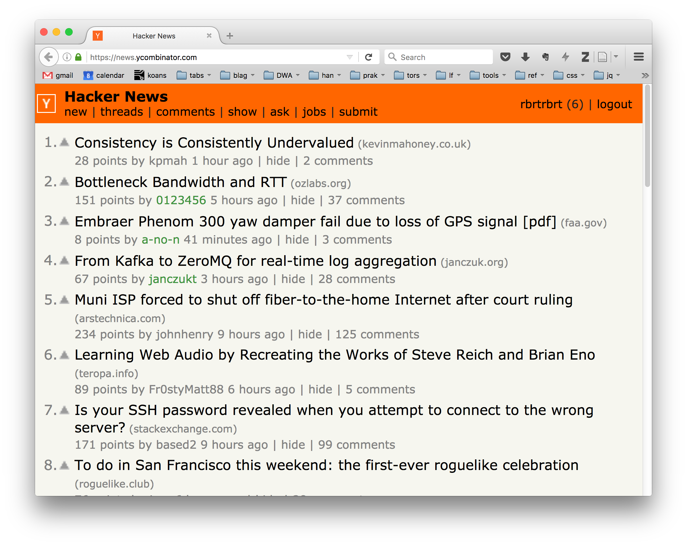
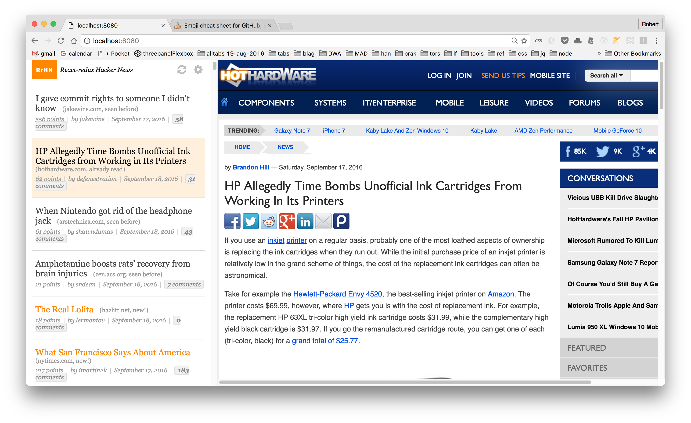
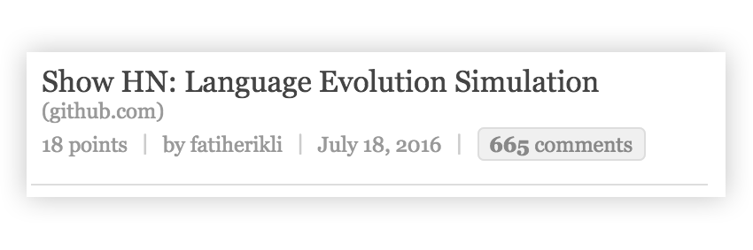

# The React-redux Hacker News client

In this series of assignments, you're going to build an alternative front-end application to the famous Hacker News site. **Hacker News (HN)** is a site whose audience focuses on all kinds of subjects that revolve around software engineering and the Silicon Valley start-up culture. It is also one of the very best places to learn about interesting developments in modern web technology, so every web developer should visit HN regularly.

The official site allows people to **post and up-vote interesting articles** or other items from the internet. Other users can then add comments to the items, and comments can be up- and down-voted. From the submitted items, and their up-votes (and a bit of artificial intelligence), the HN front page is composed, and updated regularly. This front page is called the list op **Top Stories**.

The official HN site has a very simple user-interface. It is neither very user friendly, nor good looking.



 Because of this, there are a number of alternative font-ends which we'll call _HN clients_. Some of these clients are Web apps, others are mobile applications. They get their data from either the official HN API, of by _scraping_ the offical website.

In contrast to almost all of these HN clients, we're not looking to duplicate all the features of HN. We're going to build an **SPA that focuses on _lurkers_**. Our lurkers are people who visit HN very often (even compulsively, sometimes), but who are not interested in participating in the comment-threads, or in voting for items or comments. Lurkers just need a very good **HN viewer**.

## The RrHN client

Ultimately, the RrHN app will consist of both a client-side SPA and a server app. This server app has two jobs:
1. To keep track of which items have been either _read_ by the user, or have already been _seen_ by the user.
2. To provide a more convenient API to the RrHN client than the official HN API. (The official API requires 61 HTTP requests to get a list of 60 HN items. Our API sends all items in a single HTTP response.)

This server will be provided to you in a few days. Your job will be to create the RrHN client. This client will add two features that is are important to compulsive lurkers:
1. It will highlight the items on the HN front page that have newly appeared since the last time the lurker checked the front page.  
2. It will allow the user to see the web pages that HN items refer to, _without_ the user having to leave the list of top stories (by displaying the list and the website side-by-side)

Here is an example of what the RrHN could look like:
  
Note the list of top stories on the left with new items highlighted in orange.

In the RrHN client you will use the following technologies:
* Facebook's **React** to create the DOM for the user-interface.
* **React-router** to give the Single Page App  multiple entry points by URL.
* **Redux** to manage the application data in a way that allows the programmer to use a _time-travelling debugger_.
* AJAX to communicate with the RrHN-server.
* **Webpack** to bundle your JS-modules before sending them to the browser, and to enable _Hot Module Reloading_.
* If you want to, some **ES6**: class syntax, `const` and `let`, arrow functions, modules etc. You are, however free to stick with ES5 in combination with CommonJS modules.

## Step 1: project setup.

:point_right: Make sure you've downloaded of git-cloned the starter files to you own system of virtual machine.

:point_right: Open a command-line terminal, and navigate to the directory with the RrHN-client.  

:point_right: The project in the starter-files uses NPM modules, both for the code itself (react etc.) and for some development tools (webpack, babel). Install all the modules you need by executing:
```
npm install
```  

:point_right: You'll be using the _Webpack development server_ to bundle the JS modules, and serve the client to the browser. Start the Webpack development server from the command-line like this:
```
./node_modules/.bin/webpack-dev-server --inline
```
The `--inline` argument to webpack-dev-server is needed to prevent the Webpack Dev Server from putting your entire application in an &lt;iframe&gt;, which causes problems with the React Hot Loader.


:point_right: Open a web-browser, and have it navigate to [http://localhost:8080](http://localhost:8080). You should see a web-page telling you thet there are 60 Hacker News items available.


#### step 1 – reflection

These steps verify that you've got a working project set-up. These are a few aspects of the set-up you've just downloaded and started:

*  It contains **a minimal React app**. See in the source code how a React component called 'App' is loaded. The app also uses JSX syntax.
* It has Webpack configured to use the **Babel transpiler** to convert JSX en ES6. The code uses ES6 class-syntax to create the React component.
* It does not (yet) use live data from HN. Instead, **a static data file** with 60 test-items is provided ('frontpageData.js') that is imported like a normal ES6 module.
* The main HTML-file is called `index.html`, and it lives in the `dist` directory. This directory is the directory that our Webpack configuration says is the directory that all static files (i.e. html, css, images etc.) are served from. You don't need to use the name 'dist' as part of the URL for any of these files.
* The Webpack configuration file also tells Webpack to store the generated the bundled JS modules in the directory `dist` (in a file called `bundle.js`). But this `bundle.js` is _never saved_ by the Webpack-dev-server. Webpack-dev-server does generate the file, but **it keeps the file in main memory**, and serves it from there. It does not store the file to the harddrive. (The is also a command-line version of Webpack that does save the file, and that one is generally used for production-builds.)

#### Some tips:

:thumbsup: Don't forget to do an `npm install` whenever you clone your repo on another computer, or merge-in new versions of the code you get from your teacher.

:thumbsup: Add `./node_modules/.bin` to your `PATH` environment variable -- it saves typing commands that come with npm modules like Webpack. After adding the directory to the PATH, you can start the dev-server like this:
```
Webpack-dev-server --inlne
```


:lollipop: Layout in CSS can be a major pain-in-the-###, unless you use CSS Flexbox properties. The example HTML/CSS uses flexbox. If Flexbox is new to you, take some time to understand it. It will save you a lot of time.  
Here are some interactive guides to flexbox: [flexbox in 5 minutes](http://flexboxin5.com/) and [The Flexbox Game](https://www.flexboxgame.com/). Also, look at [A Complete Guide to Flexbox](https://css-tricks.com/snippets/css/a-guide-to-flexbox/) to see the flexbox in code.

### One more step!

#### The trouble with iframes

If you take a look at the HTML examples, you'll see that right-hand side of the page shows site inside an iframe. Some sites don't want that, and they try to prevent to browser from showing their pages in an iframe.  
Modern browsers check for an HTTP header called `X-Frame-Options:`. If this header exists in the response, the browser will refuse to show the site in your iframe.  
This is unfortunate for the professional HN lurker who wants to view the list and the sites side-by-side.

:point_right: For this series of exercises, use install the Chrome extension "[Ignore X-Frame headers](https://chrome.google.com/webstore/detail/ignore-x-frame-headers/gleekbfjekiniecknbkamfmkohkpodhe)", or "[Ignore X-Frame-Options](https://addons.mozilla.org/en-US/firefox/addon/ignore-x-frame-options/)" for Firefox, to make the browser ignore  X-Frame-Options, so our RrHN iframe will work fine.

## Step 2: Show the first item in the list

Before we're going to create the entire list of items in the left column, let's create just a single list item.  

:point_right: Create a React component (in its own JSX file!) called `ListItem`, that receives a single HN item (like the ones in 'frontpageData.js') through it's `props`, and renders HTML that displays the item as it should appear in the left-column list. Something like this:



:point_right: Adapt the `App` component to make sure the item appears in the left-column, and receives (through its `props`), the first item from the file 'frontpageData.js'.  
It is best if the `App`-component reads the `frontpageData.js` file, and hands down the data to it's sub-components (using `props`).

Your page does not have to have a right-hand area just yet, but if you do include one, it does not have to show anything.

:lipstick: The image above is based on the example HTML and CSS. **You don't have to use those**. Feel free to create your own styling for your project.

## Step 3: Show a list with all 60 items.

:point_right: Create a new React component called `ItemList`. Its job is to receive _the entire list of HN items_, and render a complete list in the left-hand column.

:point_right: It should use the list of HN items to create a list of `ListItem` components, which it can render.

:lollipop: For creating a list (array) of new output values, based on another list of input values, one typically uses [the array method `map()`](http://adripofjavascript.com/blog/drips/transforming-arrays-with-array-map.html).

:point_right: Adapt your `App` component to render an `ItemList` instead of a `ListItem`.

## Step 4: show some content in an iFrame in the right-hand area of the page.

:point_right: Create a new component called `IFrameArea`. This component should render an `<iframe>` which fills the right-hand area of the page. It should receive the URL of the page to show in the iframe from its `props`.

:ghost: iFrames are tricky to layout using CSS. They don't cooperate in the way you expect from `<div>`s or other bock-level elements. Flexbox, however, works fine with iframes, so use it here. If you're using the example HTML and CSS, this is already done for you.  

Some sites contain JS code to detect it they're in an iframe, and try to interfere with the surround page, or annoy the user.  
:point_right: Prevent this by copying the `sandbox`-attribute on the iframe (by copy-pasting it from the example HTML if you want).

:point_right: Adapt your `App` component to fill the right-hand area with the `IFrameArea`, using a hard-coded URL such as `http://http://www.teletubbies.com/`.  
_Making the right-hand area respond to clicks on items in the left-hand column is the goal of the next step, not this one._


#### adding some application state

The URL for the IFrameArea will change while the user is playing with the application. This requires us to introduce some _application state_ into our app: a variable that contains changing information during the lifetime of our app.

:question: Think about it: Which React component should store this application state? The `App`, `ItemList`, `IFrameArea`, or (one of) the `ListItems`?

Instead of just keeping track of the current URL for the iframe, it's going to be useful to store the _entire HN item_ that the user is currently viewing.  
But: every HN item has three representations in our app:
1. The data-object from 'frontPageData.js'.
2. The corresponding `ListItem` React component, as is will be generated by the `ItemList` component, and
3. The final DOM/HTML structure that is shown to the user by the browser.
In React applications, application state should refer to data-objects, not to React components or DOM elements. So we'll store the data-object from 'frontPageData.js' that describes the HN item the user is viewing. From this data-object, we'll extract the URL to feed the `IFrameArea`.

:point_right: Give the component of your choice a field _inside its `state` field_, that will refer to the data-object of the _selected HN item_. Call this field `selectedItem`, and initialize its value to the first (or second, third, whatever) item in the item list from 'frontpageData.js'.

:point_right: Make sure that the `IFrameArea` shows the site of the HN item that is now being stored in the application state.
